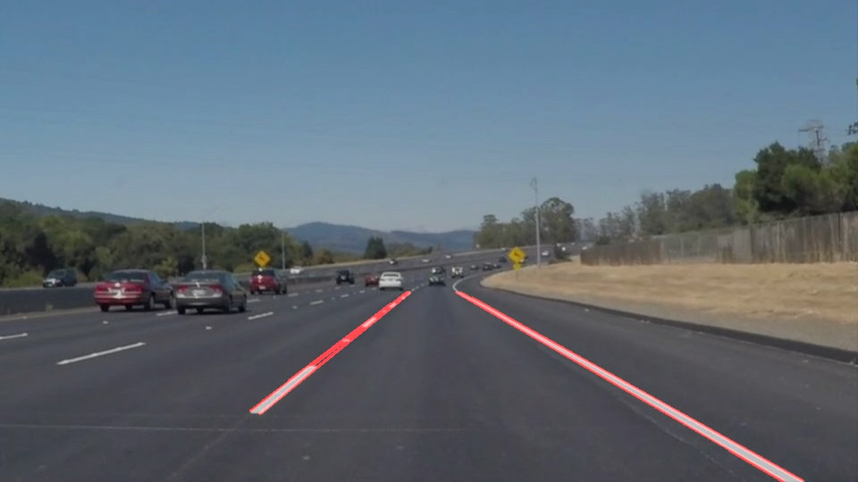

# **Finding Lane Lines on the Road** 

The goals / steps of this project are the following:
* Make a pipeline that finds lane lines on the road
* Reflect on your work in a written report

[//]: # (Image References)

[image1]: ./examples/grayscale.jpg "Grayscale"

---

## Reflection

## 1. Pipeline:

### My pipeline consisted of 6 steps. 
1. Convert the image into greyscale.
![alt text][image1]
2. Apply gaussian blur.
3. Apply Canny edge detection.
4. Select the region of image where the lanes are likely to be.
5. Apply Probabilistic Hough Line transformation. use np.polyfit and np.poly1d to fit lines.
6. Overlap this image with the original image

### In order to draw a single line on the left and right lanes, I modified the draw_lines() function as below:
1. I obtained the slope each of the lines after Hough transformation.
2. If the slope is negative, I considered it to be left lane otherwise it is the right lane.
3. Caculate the mean of all lines slop, drop the lines' the slop is bigger than the threshold.
4. fitting left and right lines with numpy's API: np.polyfit and np.poly1d.
5. The image is overlaped with the original image to mark the lanes.

### Chanllenge part:
1. Convert the RGB image to HSL image. (select the white and yellow colored points, and mask white to return)
    - I also tried HSV, HSL had better results.
2. Convert the image into greyscale.
3. Apply gaussian blur.
4. Apply Canny edge detection.
5. Select the region of image where the lanes are likely to be.
6. Apply Probabilistic Hough Line transformation. use np.polyfit and np.poly1d to fit lines.
7. Overlap this image with the original image

### 2. Identify potential shortcomings with your current pipeline
* Curved lanes are not easy to fit, as i fit lines with a polynomial of degree 1.
* The line segments in the video are very jerky. Line segment from the previous frame doesn't blend into the next frame.

### 3. Suggest possible improvements to your pipeline
* Use a quadratic or higher order equation to fit the lanes, so that curved lanes can also be fit properly.
* Remember the lane history of previous frames to render a smooth lane detection in the video.
    